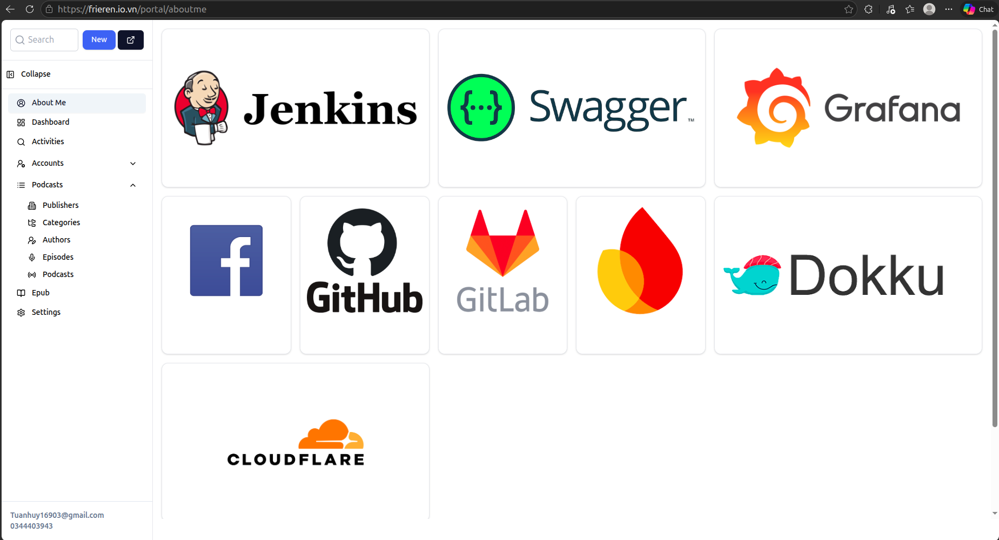
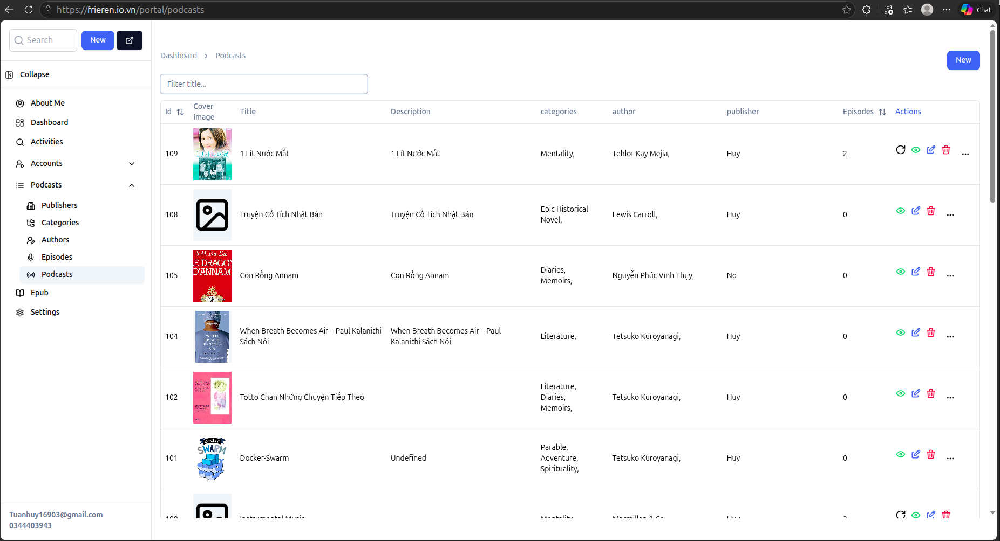
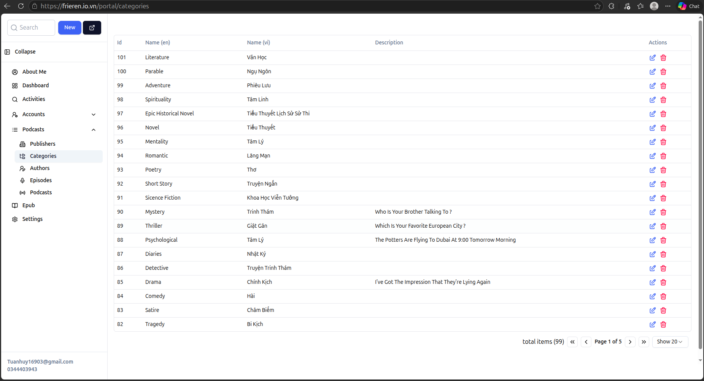
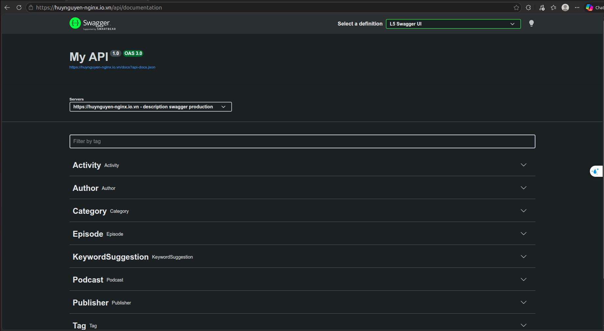
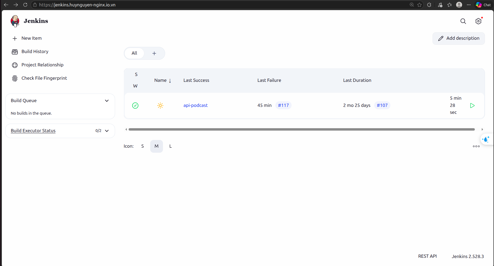
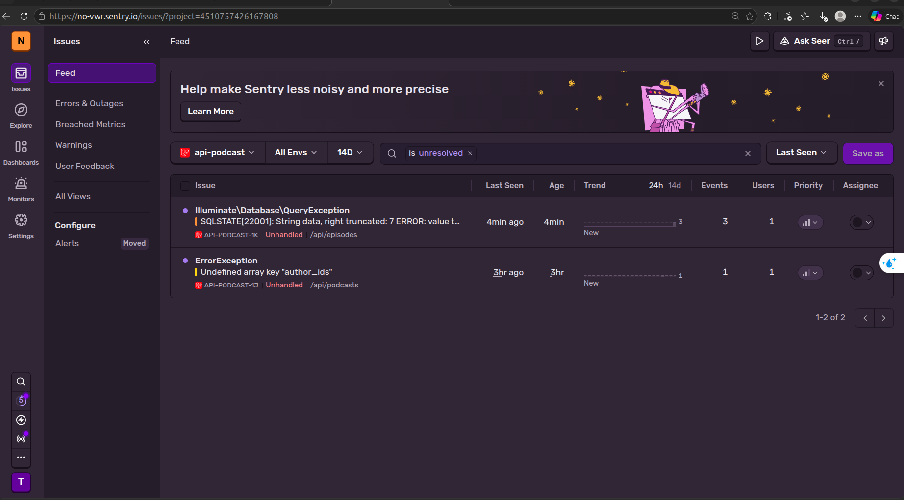

<div align="center">

# 🎧 Podcast App

### Public Self-Hosted Podcast Platform



👉 https://frieren.io.vn/portal/aboutme

<br/>


</div>

---

# 🚀 About The Project

This project is a **public self-hosted podcast platform** that allows users to contribute and listen to podcast content through a modern CMS portal and REST API.

Users can:

✅ Add podcasts  
✅ Import audio URLs  
✅ Upload image URLs  
✅ Create authors  
✅ Create genres/categories  
✅ Add podcast episodes  
✅ Listen directly from `/podcast`

---

# 🖥️ Portal CMS

The portal acts like a mini CMS system for podcast management.

<div align="center">

</div>

---

# 🎙️ Podcast Management

Users can manage podcast content, episodes, authors, and categories.

<div align="center">


</div>

---

# ⚙️ How It Works

This project is intentionally public.

Anyone can contribute podcast content by using the API.

## 📌 Workflow

```text
Create Author
      ↓
Create Genre
      ↓
Create Podcast
      ↓
Add Podcast Episodes
      ↓
Provide Audio/Image URL
      ↓
Open /podcast
      ↓
Listen 🎧
```

---

# 🌍 Audio Source

Audio files are not uploaded directly to the server.

Instead, contributors provide public audio URLs.

You can use:

- Your own hosting
- Public CDN links
- Archive.org
- Other public audio storage

---

# 📚 Public Archive Source

The creator also provides public podcast archives here:

👉 https://archive.org/details/@nguy_n_tuan_huy16903

---

# 🔥 Swagger API Documentation

The backend API includes Swagger/OpenAPI documentation.

<div align="center">

</div>

👉 https://huynguyen-nginx.io.vn/api/documentation

Features:

- REST API
- OpenAPI/Swagger
- Authentication
- Podcast APIs
- Filtering
- Pagination
- Logging

---

# 🏗️ Technologies Used

## 🎨 Frontend

| Technology | Purpose            |
| ---------- | ------------------ |
| React 19   | Frontend Framework |
| TypeScript | Type Safety        |
| ShadCN UI  | UI Components      |
| Vite       | Build Tool         |

---

## ⚡ Backend

| Technology | Purpose           |
| ---------- | ----------------- |
| Laravel 11 | API Backend       |
| PostgreSQL | Database          |
| Swagger    | API Documentation |
| Docker     | Containerization  |

# ☁️ Infrastructure & Home Networking

Thay vì sử dụng các dịch vụ VPS đám mây, toàn bộ hệ thống Backend và Database của dự án được vận hành trên **hệ thống server vật lý (Bare-metal)** đặt tại nhà.

## 🏗️ Hardware Stack

- **Workstation:** Dell OptiPlex Micro Series (Compact & Energy Efficient).
- **OS:** Ubuntu 26.04 LTS (Noble Numbat).
- **Networking:** Kết nối qua Switch Gigabit và dây LAN Cat6 để đảm bảo độ trễ thấp nhất.

## 🌐 Hybrid Deployment Architecture

```text
[ User Browser ]
       |
       |--------------------------------|
       v                                v
[ Vercel Edge ]                [ Cloudflare Proxy ]
(Host Frontend)                (DDNS & Protection)
       |                                |
[ frieren.io.vn ]                       v
                         [ Home Network (Port Forwarding) ]
                                        |
                         [ Physical Dell Workstation ]
                                (Ubuntu Server)
                                        |
                               [ Nginx Reverse Proxy ]
                                (Certbot SSL/HTTPS)
                                        |
                               [ Laravel API Docker ]
```

<div align="center">

</div>

# 🔄 CI/CD Pipeline

This project uses a self-hosted CI/CD pipeline powered by Jenkins.

<div align="center">

</div>

👉 https://jenkins.huynguyen-nginx.io.vn/

# 📊 Monitoring & Tools

Dự án tích hợp các công cụ giám sát để đảm bảo hệ thống vận hành ổn định và phát hiện lỗi kịp thời.

<div align="center">

</div>

| Tool       | Usage            | Layer           |
| ---------- | ---------------- | --------------- |
| **Sentry** | Error Tracking   | Application     |
| Jenkins    | CI/CD            | Self-hosted     |
| Swagger    | API Docs         | Backend         |
| Grafana    | Monitoring       | Infrastructure  |
| GitHub     | Source Control   | Cloud           |
| Nginx      | Reverse Proxy    | Physical Server |
| Cloudflare | Proxy & Security | DNS Layer       |

### 🛡️ Error Tracking with Sentry

tôi sử dụng **Sentry** để theo dõi lỗi trong thời gian thực trên cả Frontend và Backend.

- **Real-time Alerting:** Thông báo ngay lập tức khi có lỗi xảy ra.
- **Exception Tracking:** Theo dõi chi tiết các lỗi Laravel (Eloquent, Query, v.v.).
- **Performance:** Đo lường thời gian phản hồi của API.

<div> I have now disabled Grafana and InfluxDB to prevent the hardware from overheating and to keep the server running smoothly.  </div>
</div>

👉 [](https://no-vwr.sentry.io/projects/api-podcast/)

# 🎯 Project Goals

This project was built to:

- Learn fullstack architecture
- Practice self-hosting
- Build a podcast ecosystem
- Learn DevOps
- Practice CI/CD
- Experiment with infrastructure scaling
- learn React
- learn Laravel
- learn Sql

---

# 👨‍💻 Author

<div align="center">

## Nguyen Tuan Huy

Self-hosted • Fullstack • DevOps • Laravel • React

</div>
```
